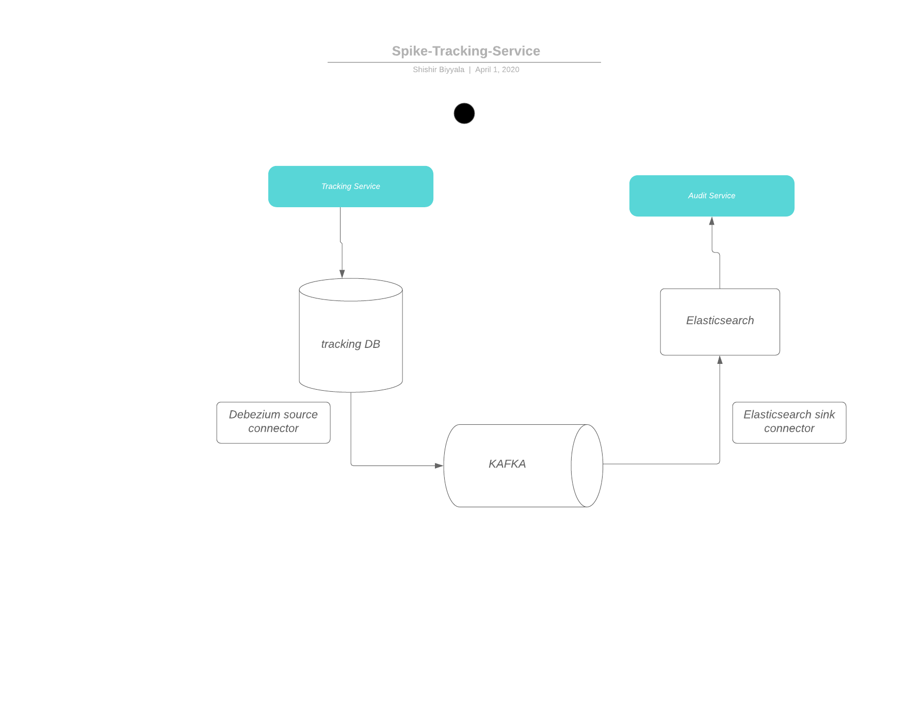

# [Spike] Implementing Outbox Pattern



## Tracking service
1. Has a single endpoint to "create" a record
2. Has an `outbox` table which houses events to be consumed by `Debezium` 
### Connectors
1. `Debezium` "source" connector, hooked to the `Outbox`
2. `Elasticsearch` "sink" connector, indexing generated `events`
      
### Sample requests
1. `curl -X POST http://localhost:8080/api/parcel -H  "Content-Type:application/json"  -d '{"contents":"Kotlin is cool"}'`

### Useful commands
1. For problems with "flyway_schema_history": 
` ./gradlew flywayRepair`

## Kafka
Create `parcel_created` topic:
```
docker exec -t kafka /usr/bin/kafka-topics \
      --create --bootstrap-server :9092 \
      --topic parcel_created \
      --partitions 1 \
      --replication-factor 1
```

Register connectors:
```
curl -i -X POST -H "Accept:application/json" -H  "Content-Type:application/json" http://localhost:8083/connectors/ -d @kafka-connectors/dbz-source-connector.json
curl -i -X POST -H "Accept:application/json" -H  "Content-Type:application/json" http://localhost:8083/connectors/ -d @kafka-connectors/es-sink-connector.json
```

Delete connector (example):
```
curl -X DELETE http://localhost:8083/connectors/elasticsearch-sink
```

Consuming Kafka Topics:
```shell
docker exec -t kafka /usr/bin/kafka-console-consumer \
      --bootstrap-server :9092 \
      --property print.key=true \
      --from-beginning \
      --topic parcel_created
 ```

## Elasticsearch
To confirm that "sink"ing happened correctly

```
http://localhost:9200/_cat/indices?v
http://localhost:9200/_search?index=parcel_created
```